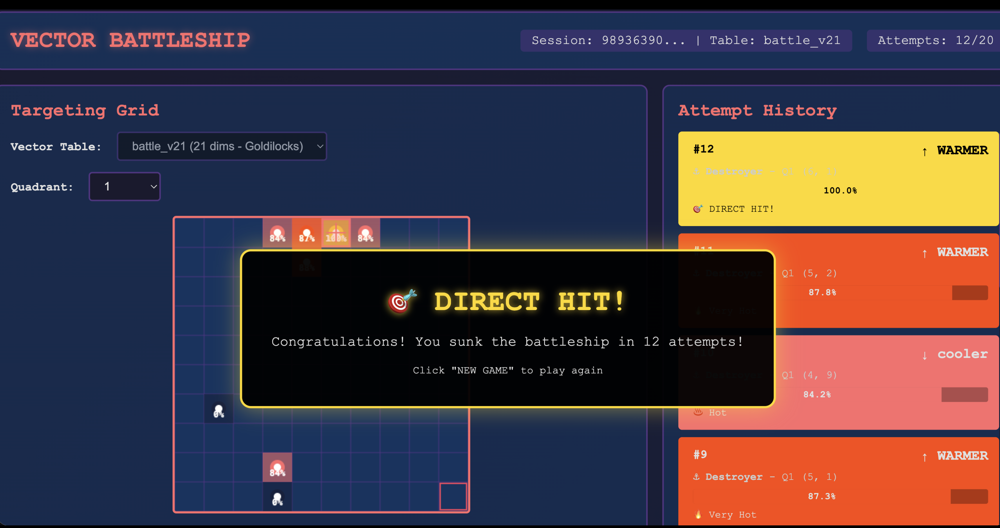

# dragonflydb-vector-battleship
A remake of the battleship game - this time using dragonflydb as the vector database

# Python Environment Setup 
- **A: Create a virtual environment:**

```
python3 -m venv dfenv
```

- **B. Activate it:  [This step is repeated anytime you want this venv back]**

```
source dfenv/bin/activate
```

On windows you would do:

```
dfenv\Scripts\activate
```
If no permission in Windows
 The Fix (Temporary, Safe, Local):
In PowerShell as Administrator, run:
```

Set-ExecutionPolicy -Scope CurrentUser -ExecutionPolicy RemoteSigned
```
Then confirm with Y when prompted.


- **C. Install the libraries: [only necesary to do this one time per environment]**

```
pip3 install -r requirements.txt
```

# prepare the dragonflydb with target battle ships:

- **Make sure you have ships in the database (use populate_quadrants.py ) NB: Be sure to set the vector type based on the dimensions you intend to use:**

```
export BATTLESHIP_TABLE=vb.battle_v21
```

- **Run the populate_quadrants.py program to write a bunch of battleships into the database:**

- **If you do not specify the --host --port etc it defaults to localhost 6379**

```
python3 populate_quadrants.py <number_of_ships_to_create> <number_of_quadrants> --host hostmenow.com --port 10000 --password supersecurepw --use-tls true --ssl-cert-reqs none 
```

example with small dataset:

```
python3 populate_quadrants.py 15 4
```

example with large dataset:

```
python3 populate_quadrants.py 15000 3000
```

## Web-Based UI: Play Vector Battleship in your browser
<a id="web-ui"></a>



A single-file web interface using the Bottle framework provides visual feedback with color-coded heat maps showing how close you are to finding ships.

To play with a web-UI: Start the web server from the project root directory:

- **If you do not specify the --host --port etc it defaults to localhost 6379**

```
python3 bottle_web_ui.py --host hostmenow.com --port 10000 --password supersecurepw --use-tls true --ssl-cert-reqs none
```

The server will start on http://localhost:8000

- **Open your browser and navigate to:**

```
http://localhost:8000
```

### How to Play

- **Select Vector Dimensions**: Choose which Vector Table to target (dropdown at top of grid) [make certain you choose the same type that you set with the export BATTLESHIP_TABLE= command earlier]
- **Click 'Start Game'**: Each Game is specific to a type of vector and the table holding those ships
- **Select Quadrant**: Choose which quadrant to target (dropdown at top of grid)
- **Choose Ship Type**: Select submarine, destroyer, skiff, or aircraft carrier
- **Select Coordinates**: Click on the grid or use the X/Y sliders to pick coordinates
- **Fire Torpedo**: Click the "FIRE TORPEDO!" button to attempt targeting
- **View Results**:
  - Match percentage shows how close you are (higher = closer)
  - Color coding: Blue (cold) → Purple (cool) → Pink (warm) → Red (hot) → Gold (direct hit!)
  - Trend indicators show if you're getting warmer (↑) or cooler (↓)
  - Previous attempts appear on the grid with colored markers

Win by achieving a 100% match within 20 attempts!

# There is a rules-based battle-bot program that you can run from the commandline which will fire queries adjusting and honing in on ships in a quadrant.  

- **Run a battle bot that repeatedly generates ship vectors and then tests for their overlap in the vector space (it gets 100 tries):**
```
You need all of the following ordered args: 

<percentage> <max_attempts> <sleep_time> <should_switch_quadrants>
Example: python3 battle_bot.py 65 100 0 False
```

- **If you do not specify the host port etc it defaults to localhost 6379**

```
python3 battle_bot.py <percentage> <max_attempts> <sleep_time> <should_switch> --host hostmenow.com --port 10000 --password supersecurepw --use-tls true --ssl-cert-reqs none
```

## NB: the battle_bot runs until it runs out of attempts or hits a ship with an exact match on type, location, and quadrant

## It will use the match_percentage_threshold as a guide to hone in on ship_type and quadrant which should speed up finding exact matches  (the lower the threshold, the more sticky the attampts will be to the same quadrant and ship_type)


